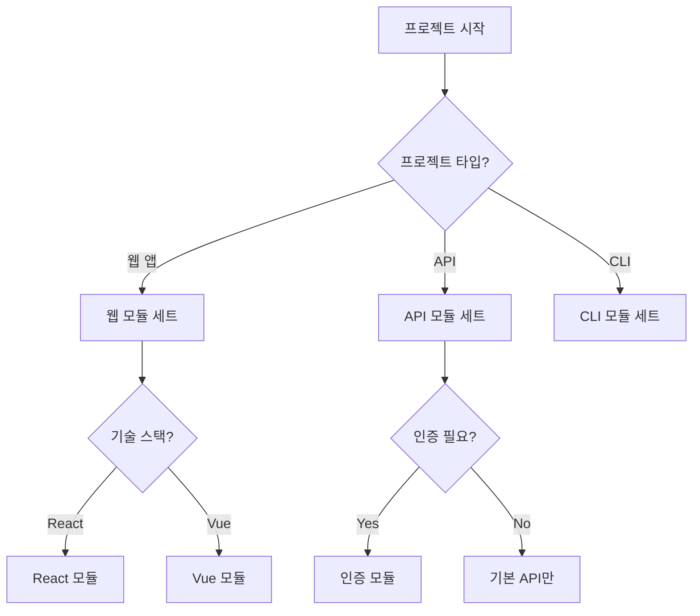

# 원칙 4: 모듈식 확장성

## 핵심 개념
프로젝트별로 필요한 부분만 선택하고 커스터마이징할 수 있는 유연한 구조입니다.

## 왜 중요한가?

### 문제 상황
```
"모든 프로젝트에 같은 템플릿 강제"
→ React 프로젝트에 백엔드 가이드
→ API 서버에 UI 컴포넌트 규칙
→ 불필요한 복잡성과 혼란
```

### 해결된 상황
```
"프로젝트에 맞는 모듈만 선택"
→ React: UI 컴포넌트 + 상태관리 가이드
→ API: RESTful 패턴 + 인증 가이드
→ 정확히 필요한 것만
```

## 구현 방법

### 1. 계층적 구조
```
기본 템플릿 (Base)
    ↓
프로젝트 타입별 확장 (Extensions)  
    ↓
프로젝트별 커스터마이징 (Custom)
```

### 2. 오버라이드 메커니즘
```yaml
# 우선순위 (높음 → 낮음)
1. .claude/custom/overrides/     # 최우선
2. .claude/custom/contexts/      # 추가 컨텍스트
3. .claude/templates/            # 기본 템플릿
```

### 3. 조건부 포함
```markdown
<!-- if:has feature:api -->
@.claude/templates/api-guide.md
<!-- endif -->

<!-- if:has tech:react -->
@.claude/templates/react-patterns.md
<!-- endif -->
```

## 모듈 카탈로그

### 핵심 모듈 (항상 포함)
```
- project-info           # 기본 프로젝트 정보
- work-principles        # 작업 원칙
- dev-principles         # 개발 원칙
```

### 선택적 모듈
```
# 백엔드
- api-patterns          # API 설계 패턴
- database-guide        # DB 스키마 가이드
- auth-system           # 인증/인가

# 프론트엔드  
- component-guide       # 컴포넌트 구조
- state-management      # 상태 관리
- styling-system        # 스타일 가이드

# 공통
- testing-strategy      # 테스트 전략
- deployment-guide      # 배포 가이드
- monitoring-setup      # 모니터링
```

## 확장 패턴

### 1. 추가 (Addition)
```yaml
# 기본 + 추가
base_principles:
  - code_quality
  - documentation

custom_additions:
  - accessibility    # 추가
  - performance      # 추가
```

### 2. 대체 (Override)
```yaml
# 기본 템플릿 대체
templates:
  work-principles: 
    use: "custom/agile-principles.md"  # 대체
```

### 3. 확장 (Extension)
```markdown
# 기본 내용 확장
<!-- extend:after .claude/templates/core/dev-principles.md -->
## 추가 개발 원칙
- 마이크로서비스 통신 규칙
- 이벤트 드리븐 아키텍처 가이드
<!-- end:extend -->
```

## 적용 예시

### 간단한 스크립트 프로젝트
```yaml
modules:
  - core/essentials      # 최소 구성
  - contexts/scripting   # 스크립트 특화
```

### 대규모 엔터프라이즈
```yaml
modules:
  - core/*               # 모든 핵심 모듈
  - enterprise/*         # 엔터프라이즈 패턴
  - compliance/*         # 규정 준수
  - team-collaboration/* # 팀 협업
custom:
  - company-standards/   # 회사 표준
```

### 오픈소스 프로젝트  
```yaml
modules:
  - core/*
  - opensource/contributing
  - opensource/code-of-conduct
  - ci-cd/github-actions
```

## 모듈 선택 가이드



## 측정 가능한 효과

1. **관련성**: 100% 관련된 가이드만 제공
2. **복잡도 감소**: 불필요한 정보 80% 제거  
3. **온보딩 시간**: 2시간 → 30분

## 핵심 원리

> "필요한 것만, 필요한 만큼, 필요한 방식으로"

- **선택적 포함**: 모든 것은 옵션
- **쉬운 확장**: 새 모듈 추가 간단
- **깔끔한 구조**: 복잡성 최소화

---

모듈식 확장성은 Clauder를 모든 프로젝트에 
맞출 수 있는 유연한 시스템으로 만듭니다.