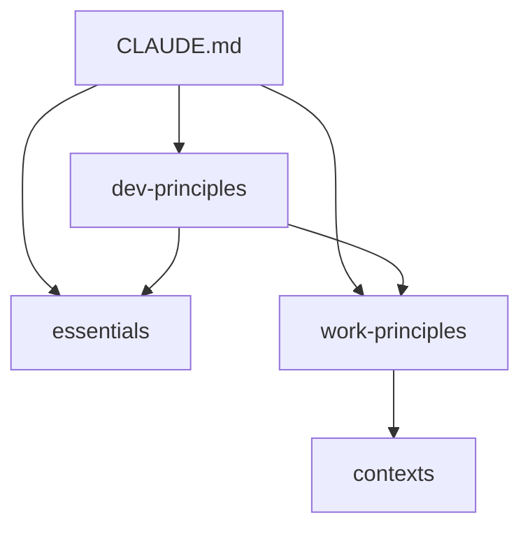

---
version:
  created: "2025-08-02"
  updated: "2025-08-02"
  commit: "8b8a539"
  
dependencies:
  - file: ".claude/aliases.yaml"
    commit: "8b8a539"
  - file: ".claude/references.yaml"
    commit: "8b8a539"
  - file: ".claude/scripts/reference-parser.py"
    commit: "8b8a539"
---

# /clauder ref

문서 참조를 효율적으로 관리합니다.

## 사용법

```
/clauder ref [action] [options]
```

### 액션
- `check` - 참조 일관성 확인
- `update` - 참조 형식 업데이트
- `graph` - 참조 그래프 생성
- `migrate` - 기존 참조를 새 형식으로 마이그레이션
- `stats` - 참조 통계 확인

## 명령어 상세

### 1. 참조 확인 (`check`)
```
/clauder ref check [file|all]
```
특정 파일 또는 전체 프로젝트의 참조 상태 확인:
- 존재하지 않는 파일 참조
- 오래된 버전 참조
- 순환 참조

### 2. 참조 업데이트 (`update`)
```
/clauder ref update [file|all]
```
참조를 최신 형식으로 업데이트:
- @ 참조 → @[] 형식
- 버전 정보 추가
- 별칭 적용

### 3. 참조 그래프 (`graph`)
```
/clauder ref graph [--format mermaid|dot]
```
문서 간 참조 관계를 시각화

### 4. 마이그레이션 (`migrate`)
```
/clauder ref migrate [--dry-run]
```
전체 프로젝트의 참조를 새 형식으로 일괄 변환

### 5. 통계 (`stats`)
```
/clauder ref stats
```
참조 사용 통계 표시

## 실행 예시

### 참조 확인
```
User: /clauder ref check
Claude: 📊 참조 상태 확인 중...

✅ 정상 참조: 45개
⚠️ 버전 없는 참조: 12개
❌ 깨진 참조: 2개
  - README.md:34 → .claude/old-file.md (파일 없음)
  - CLAUDE.md:78 → .claude/deleted.md (파일 없음)

순환 참조: 없음

권장사항: /clauder ref update all 실행
```

### 참조 업데이트
```
User: /clauder ref update README.md
Claude: 🔄 README.md 참조 업데이트 중...

변경사항:
- Line 15: @.claude/README.md → @[$claude/README]#8b8a539
- Line 23: @.claude/templates/core/01-essentials.template.md → @[$essentials]#8b8a539
- Line 45: @.claude/custom/project.yaml → @[$project]#8b8a539

✅ 3개 참조 업데이트 완료
```

### 참조 그래프
```
User: /clauder ref graph
Claude: 📈 참조 그래프 생성...



주요 허브:
1. work-principles (15개 참조)
2. essentials (10개 참조)
3. CLAUDE.md (8개 참조)
```

### 마이그레이션
```
User: /clauder ref migrate --dry-run
Claude: 🔍 마이그레이션 시뮬레이션...

변환될 참조:
- @ 참조: 20개 → @[] 형식
- 별칭 적용 가능: 15개
- 버전 추가: 35개

영향받는 파일: 12개

실제로 적용하려면 --dry-run 없이 실행하세요.
```

## 참조 형식

### 기본 형식
```markdown
@[경로]#커밋해시
```

### 별칭 사용
```markdown
@[$core/work-principles]#abc123d
```

### 조건부 참조
```markdown
@[$custom/work-principles|$core/work-principles]#abc123d
```

### 스마트 참조
```markdown
@[smart:error-handling]  <!-- 컨텍스트 기반 자동 선택 -->
```

## 설정

### 별칭 정의 (.claude/aliases.yaml)
```yaml
aliases:
  $core: ".claude/templates/core"
  $custom: ".claude/custom"
  $commands: ".claude/commands"
```

### 참조 레지스트리 (.claude/references.yaml)
```yaml
registry:
  work-principles:
    primary: ".claude/templates/core/02-work-principles.template.md"
    override: ".claude/custom/overrides/02-work-principles.md"
    version: "cf4b293"
```

## 통합

### Git Hook
커밋 시 자동으로 참조 업데이트:
```bash
# .git/hooks/pre-commit에 포함됨
python3 .claude/scripts/reference-parser.py update
```

### CI/CD
```yaml
# .github/workflows/docs.yml
- name: Check references
  run: /clauder ref check all --fail-on-broken
```

## 문제 해결

### Python 없음
```
⚠️ Python3가 필요합니다
brew install python3  # macOS
apt install python3   # Linux
```

### 권한 오류
```bash
chmod +x .claude/scripts/reference-parser.py
```

## 관련 문서
- 참조 전략: @[.claude/docs/design/REFERENCE_STRATEGY.md]#8b8a539
- 별칭 정의: @[.claude/aliases.yaml]#8b8a539
- 레지스트리: @[.claude/references.yaml]#8b8a539