---
version:
  created: "2025-08-02"
  updated: "2025-08-02"
  commit: "fb26a03"
---

# 🏗️ Clauder 아키텍처

## 📊 전체 구조도

```mermaid
graph TB
    subgraph "사용자 인터페이스"
        User[사용자]
        Claude[Claude Code]
    end
    
    subgraph "명령어 시스템"
        Start[/clauder start]
        Daily[/clauder daily]
        Init[/clauder initialize]
        Track[/clauder track]
        Hooks[/clauder hooks]
        Ref[/clauder ref]
        Other[기타 명령어]
    end
    
    subgraph "핵심 시스템"
        Templates[템플릿 시스템]
        Version[버전 추적]
        References[참조 시스템]
        HookSys[훅 시스템]
    end
    
    subgraph "자동화"
        GitHooks[Git Hooks]
        Instructions[Claude 지시사항]
        Scripts[스크립트]
    end
    
    subgraph "문서"
        CLAUDE_MD[CLAUDE.md]
        Docs[문서들]
        Examples[예시]
    end
    
    User --> Claude
    Claude --> Start
    Claude --> Daily
    Claude --> Other
    
    Start --> Templates
    Start --> Version
    Daily --> Version
    Track --> Version
    Hooks --> HookSys
    Ref --> References
    
    GitHooks --> Version
    GitHooks --> References
    Instructions --> Claude
    
    Templates --> CLAUDE_MD
    Version --> Docs
    References --> Docs
```

## 🗂️ 디렉토리 구조

```
clauder/
├── 📄 README.md                    # 프로젝트 소개
├── 📄 CLAUDE.md                    # Claude Code 가이드 (자동 생성)
├── 📄 EXAMPLES.md                  # 실제 사용 예시
├── 📄 ARCHITECTURE.md              # 이 문서
│
└── 📁 .claude/                     # 핵심 시스템 디렉토리
    ├── 📄 README.md               # 시스템 설명
    ├── 📄 instructions.md         # Claude 필수 지시사항
    │
    ├── 📁 docs/                   # 문서 디렉토리
    │   ├── 📁 design/             # 설계 문서
    │   │   ├── VERSION_TRACKING.md
    │   │   ├── HOOKS.md
    │   │   └── REFERENCE_STRATEGY.md
    │   ├── 📁 guides/             # 사용 가이드
    │   │   ├── WORKFLOWS.md
    │   │   └── TROUBLESHOOTING.md
    │   └── 📁 reference/          # 참조 문서
    │       └── REFERENCE_EXAMPLES.md
    │
    ├── 📁 commands/               # 명령어 정의
    │   ├── clauder-start.md      # 🚀 통합 시작
    │   ├── clauder-daily.md      # 📅 일일 체크
    │   ├── clauder-initialize.md # 🎯 초기화
    │   ├── clauder-generate.md   # 🔨 생성
    │   ├── clauder-check.md      # ✅ 확인
    │   ├── clauder-track.md      # 📊 버전 추적
    │   ├── clauder-hooks.md      # 🪝 훅 관리
    │   ├── clauder-ref.md        # 🔗 참조 관리
    │   ├── clauder-add.md        # ➕ 추가
    │   └── clauder-update.md     # 🔄 업데이트
    │
    ├── 📁 templates/              # 템플릿 시스템
    │   ├── 📄 CLAUDE.template.md
    │   ├── 📄 version-metadata.yaml
    │   ├── 📁 core/
    │   │   ├── 01-essentials.template.md
    │   │   ├── 02-work-principles.template.md
    │   │   └── 03-dev-principles.template.md
    │   └── 📁 contexts/
    │       ├── README.template.md
    │       └── 01-quick-fix.template.md
    │
    ├── 📁 custom/                 # 사용자 정의
    │   ├── 📄 project.yaml       # 프로젝트 설정
    │   ├── 📁 overrides/         # 템플릿 오버라이드
    │   └── 📁 contexts/          # 추가 컨텍스트
    │
    ├── 📁 hooks/                  # 훅 시스템
    │   ├── 📄 install.sh         # 훅 설치 스크립트
    │   └── 📁 git/
    │       └── pre-commit        # Git 커밋 훅
    │
    ├── 📁 scripts/                # 유틸리티 스크립트
    │   ├── reference-parser.py    # 참조 파서 (Python)
    │   └── reference-updater.sh   # 참조 업데이터 (Shell)
    │
    ├── 📄 aliases.yaml            # 경로 별칭 정의
    ├── 📄 references.yaml         # 중앙 참조 레지스트리
    └── 📄 settings.local.json     # 로컬 설정
```

## 🎯 핵심 시스템 구성요소

### 1. 명령어 시스템
- Claude Code 네이티브 명령어 (`/clauder` 네임스페이스)
- `.claude/commands/` 디렉토리에 정의
- 자동 완성 및 도움말 지원

### 2. 템플릿 시스템
- 변수 치환 (`{{VARIABLE_NAME}}`)
- 조건부 포함 (`<!-- if:exists -->`)
- 오버라이드 메커니즘

### 3. 버전 추적 시스템
- Git 커밋 해시 기반
- YAML front matter 메타데이터
- 의존성 및 역참조 추적

### 4. 참조 시스템
- 경로 별칭 (`$essentials`)
- 중앙 레지스트리 (`references.yaml`)
- 자동 버전 포함 (`#commit`)

### 5. 훅 시스템
- Git pre-commit hooks
- Claude instructions.md
- 명시적 자동화

## 🔄 워크플로우

### 1. 새 프로젝트 시작

```mermaid
sequenceDiagram
    participant U as 사용자
    participant C as Claude
    participant G as Git
    participant S as 시스템
    
    U->>C: /clauder start
    C->>G: Git 상태 확인
    C->>S: 프로젝트 분석
    C->>U: 3가지 질문
    U->>C: 답변
    C->>S: 파일 생성
    C->>G: 초기 커밋
    C->>U: 완료!
```


### 2. 일일 워크플로우

```mermaid
sequenceDiagram
    participant U as 사용자
    participant C as Claude
    participant V as 버전 시스템
    
    U->>C: /clauder daily
    C->>V: 문서 상태 확인
    V-->>C: 상태 리포트
    C->>U: 업데이트 제안
    U->>C: 승인
    C->>V: 자동 동기화
```


### 3. 문서 편집 시

```mermaid
sequenceDiagram
    participant C as Claude
    participant H as Hook
    participant V as 버전
    
    C->>C: 파일 편집
    C->>H: before-edit hook
    H->>V: 버전 확인
    C->>C: 실제 편집
    C->>H: after-edit hook
    H->>V: 버전 업데이트
```


## 🔍 핵심 컴포넌트 상세

### 템플릿 엔진
```yaml
# 템플릿 처리 순서
1. 변수 정의 로드 (project.yaml)
2. 조건부 평가 (if:exists)
3. 변수 치환 ({{VARIABLE}})
4. 참조 해결 (@[$alias])
5. 최종 렌더링
```

### 버전 추적 메타데이터
```yaml
---
version:
  created: "date"      # 생성일
  updated: "date"      # 업데이트일
  commit: "hash"       # Git 커밋 해시
dependencies:
  - file: "path"       # 의존 파일
    commit: "hash"     # 해당 파일 버전
    status: "current"  # 상태 (current/outdated)
---
```

### 참조 시스템 구조
```
alias.yaml     → 경로 별칭 정의
references.yaml → 중앙 레지스트리
@[$alias]#hash  → 참조 형식
```

### 훅 시스템 구성
```
1. Git Hooks
   - pre-commit: 버전 메타데이터 업데이트
   - post-commit: 참조 레지스트리 동기화

2. Claude Instructions
   - before-edit: 버전 확인
   - after-edit: 메타데이터 추가
```

## 🔧 기술 아키텍처

### 파일 시스템 계층
```
1. 명령어 계층 (.claude/commands/)
   └─ Claude Code 네이티브 통합

2. 템플릿 계층 (.claude/templates/)
   ├─ 핵심 템플릿 (core/)
   └─ 컨텍스트 템플릿 (contexts/)

3. 사용자 정의 계층 (.claude/custom/)
   ├─ 프로젝트 설정 (project.yaml)
   └─ 오버라이드 (overrides/)

4. 자동화 계층 (.claude/hooks/)
   ├─ Git hooks
   └─ Claude instructions
```

### 데이터 흐름
```
Input → 템플릿 엔진 → 변수 치환 → 다이내믹 생성 → CLAUDE.md
            ↑                           ↓
        사용자 정의 ←─────────────────┘
```

## 🎨 설계 철학

### 핵심 원칙
1. **문서 기반**: 스크립트 대신 문서로 설정
2. **명시적 자동화**: Claude 메모리 의존 제거
3. **버전 추적**: 모든 문서에 Git 커밋 해시
4. **최적화**: 참조 별칭으로 가독성 향상
5. **확장성**: 템플릿 기반 커스터마이징

### 기술 선택
- **Markdown**: 문서 및 명령어 정의
- **YAML**: 설정 및 메타데이터
- **Git**: 버전 관리 및 훅
- **Shell/Python**: 자동화 스크립트

---

이 문서는 Clauder의 기술적 아키텍처를 설명합니다. 사용자 관점의 기능은 FEATURE_MAP.md를 참고하세요.