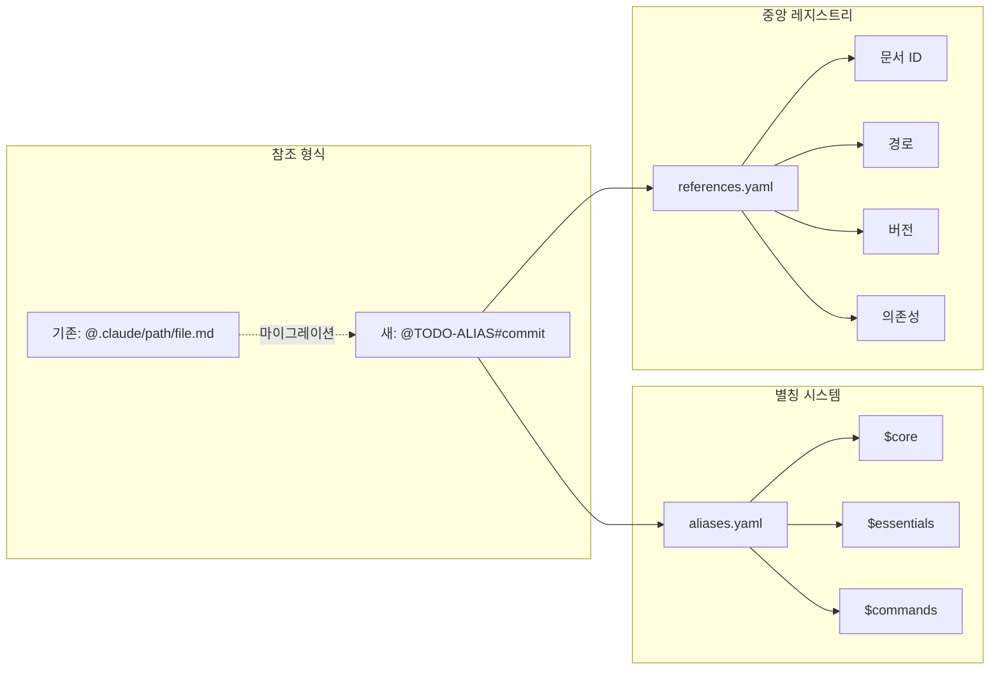
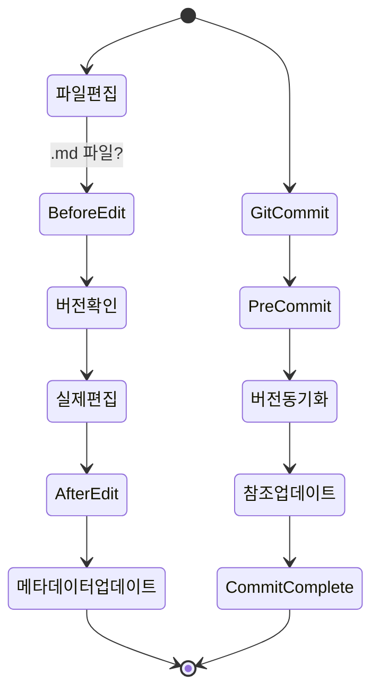
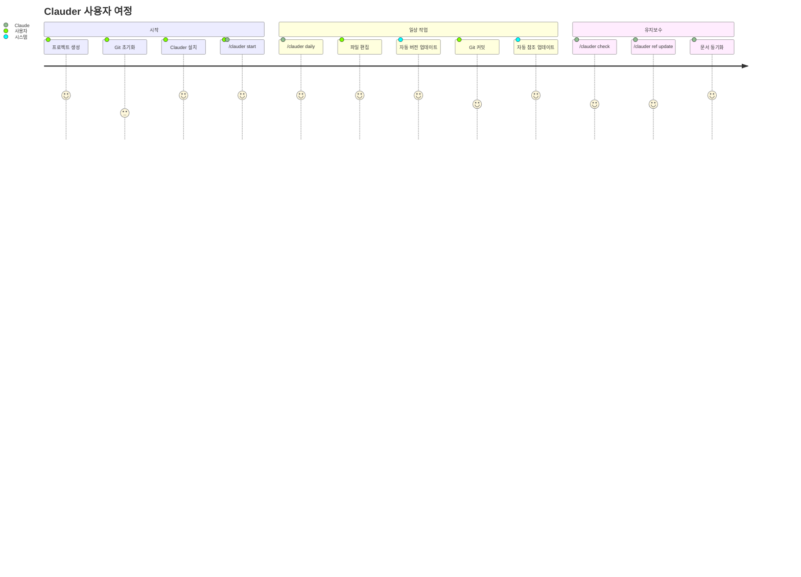

## 🎯 기능별 분류

### 1️⃣ 초기화 및 설정
```mermaid
graph LR
    A[사용자] --> B[/clauder start]
    B --> C{Git 확인}
    C -->|있음| D[프로젝트 분석]
    C -->|없음| E[Git 초기화]
    E --> D
    D --> F[3가지 질문]
    F --> G[파일 생성]
    G --> H[CLAUDE.md]
    G --> I[project.yaml]
    G --> J[훅 설치]
```

**관련 파일:**
- `/clauder start` → `.claude/commands/clauder-start.md`
- `/clauder initialize` → `.claude/commands/clauder-initialize.md`
- 템플릿 → `.claude/templates/`

### 2️⃣ 버전 추적 시스템
```mermaid
graph TB
    subgraph "버전 메타데이터"
        A[YAML Front Matter]
        A --> B[created date]
        A --> C[updated date]
        A --> D[commit hash]
        A --> E[dependencies]
        A --> F[references]
    end
    
    subgraph "추적 명령어"
        G[/clauder track add]
        H[/clauder track update]
        I[/clauder track check]
        J[/clauder track sync]
    end
    
    subgraph "자동화"
        K[Git pre-commit hook]
        L[Claude instructions]
    end
    
    G --> A
    H --> C
    H --> D
    K --> C
    K --> D
```

**핵심 구성요소:**
- 메타데이터 템플릿: `.claude/templates/version-metadata.yaml`
- 추적 명령어: `.claude/commands/clauder-track.md`
- 설계 문서: `.claude/docs/design/VERSION_TRACKING.md`

### 3️⃣ 참조 시스템


**구현 도구:**
- Python 파서: `.claude/scripts/reference-parser.py`
- Shell 업데이터: `.claude/scripts/reference-updater.sh`
- 관리 명령어: `.claude/commands/clauder-ref.md`

### 4️⃣ 훅 시스템


**훅 구성:**
- Git hooks: `.claude/hooks/git/pre-commit`
- 설치 스크립트: `.claude/hooks/install.sh`
- Claude 지시사항: `.claude/instructions.md`
- 관리 명령어: `.claude/commands/clauder-hooks.md`

### 5️⃣ 일일 워크플로우
```mermaid
graph TD
    A[/clauder daily] --> B[상태 점검]
    B --> C{문서 상태}
    C -->|최신| D[✅ 모두 최신]
    C -->|오래됨| E[⚠️ 업데이트 필요]
    E --> F[자동 동기화 제안]
    F --> G{사용자 확인}
    G -->|Y| H[동기화 실행]
    G -->|N| I[건너뛰기]
    
    B --> J[작업 제안]
    J --> K[디버깅 가이드 업데이트]
    J --> L[새 기능 문서화]
    J --> M[TODO 해결]
```

**일일 체크 항목:**
- Git 상태
- 문서 버전
- 참조 일관성
- 작업 제안

## 📊 기능 상호작용 맵

```mermaid
graph TB
    subgraph "사용자 진입점"
        Start[/clauder start]
        Daily[/clauder daily]
    end
    
    subgraph "핵심 기능"
        Track[버전 추적]
        Ref[참조 관리]
        Hook[훅 시스템]
        Template[템플릿]
    end
    
    subgraph "출력"
        CLAUDE[CLAUDE.md]
        Docs[문서들]
    end
    
    Start --> Template
    Start --> Track
    Start --> Hook
    
    Daily --> Track
    Daily --> Ref
    
    Template --> CLAUDE
    Track --> Docs
    Ref --> Docs
    Hook --> Track
    Hook --> Ref
    
    style Start fill:#f9f,stroke:#333,stroke-width:4px
    style Daily fill:#9ff,stroke:#333,stroke-width:4px
    style CLAUDE fill:#ff9,stroke:#333,stroke-width:4px
```

## 🔧 기술 스택

| 구성요소 | 기술 | 용도 |
|---------|------|------|
| 명령어 시스템 | Markdown | Claude Code 명령어 정의 |
| 버전 추적 | Git + YAML | 커밋 해시 기반 추적 |
| 참조 파싱 | Python/Shell | 문서 참조 분석 및 변환 |
| 자동화 | Git Hooks | 커밋 시 자동 실행 |
| 설정 관리 | YAML | 프로젝트 설정 및 별칭 |
| 템플릿 | Markdown + 변수 | 문서 생성 |

## 💡 혁신 포인트

### 1. 명시적 자동화
- ❌ Claude가 기억에 의존
- ✅ instructions.md로 명시적 지시
- ✅ Git hooks로 강제 실행

### 2. 효율적 참조
- ❌ 긴 경로 반복
- ✅ 별칭으로 50% 단축
- ✅ 버전 자동 포함

### 3. 통합 워크플로우
- ❌ 여러 명령어 실행
- ✅ /clauder start 하나로
- ✅ /clauder daily로 관리

### 4. 스마트 템플릿
- ❌ 정적 템플릿
- ✅ 조건부 포함
- ✅ 변수 치환
- ✅ 오버라이드 지원

## 🎨 사용자 경험 흐름



