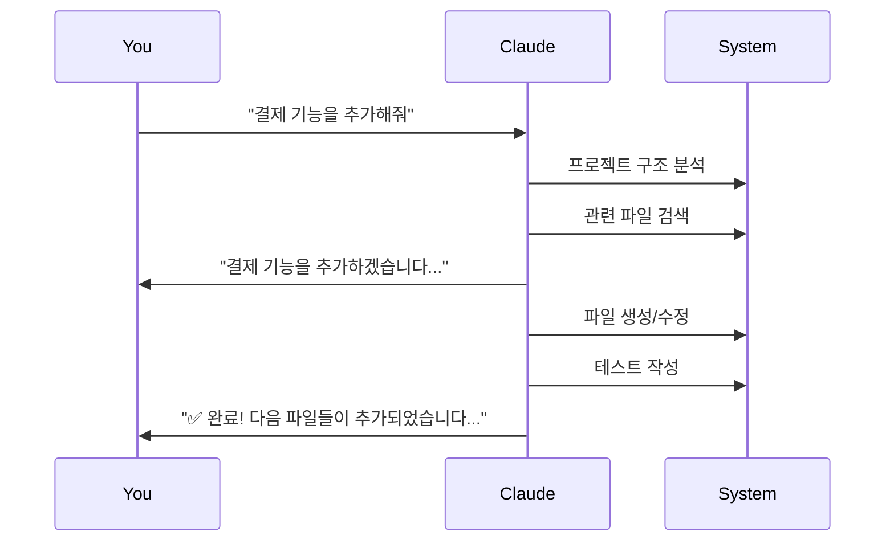

# 📸 Clauder 비주얼 튜토리얼

## 🎬 5분 안에 시작하기

### 📹 설치 과정

#### Step 1: 프로젝트 준비
```
📁 my-project/
├── 📄 package.json (Node.js)
├── 📄 README.md
└── 📁 src/
```

#### Step 2: Clauder 추가
```bash
# Claude Code에서:
/clauder start
```

#### Step 3: 질문에 답하기
```
🤖 Claude: 프로젝트 이름은 무엇인가요?
👤 You: my-project

🤖 Claude: 한 줄로 설명해주세요
👤 You: 사용자 관리 시스템

🤖 Claude: 특별한 가이드가 필요한가요?
👤 You: n
```

#### Step 4: 완료!
```
📁 my-project/
├── 📄 CLAUDE.md ✨ (새로 생성됨)
├── 📁 .claude/
│   └── 📁 custom/
│       └── 📄 project.yaml
└── 📁 docs/
```

## 🎯 일반적인 사용 시나리오

### 시나리오 1: 새 기능 추가


### 시나리오 2: 버그 수정


## 🖼️ UI 요소 설명

### Claude Code 인터페이스
```
┌─────────────────────────────────────┐
│ Claude Code                         │
├─────────────────────────────────────┤
│ 👤 You: /clauder start              │
│                                     │
│ 🤖 Claude: Clauder 초기화를 시작... │
│     ✅ Git 저장소 확인됨            │
│     📦 Node.js 프로젝트 감지        │
│                                     │
│     프로젝트 이름은?                │
│                                     │
│ 👤 You: my-api-server               │
│                                     │
└─────────────────────────────────────┘
```

## 🎨 명령어 시각화

### `/clauder` 명령어 구조
```
/clauder
├── start          # 🚀 프로젝트 초기화
├── daily          # 📅 일일 체크
├── check          # ✅ 상태 확인
├── add            # ➕ 요소 추가
│   ├── context    # 📝 컨텍스트 추가
│   └── guide      # 📚 가이드 추가
├── hooks          # 🪝 Git hooks
│   └── install    # 설치
├── personal       # 👤 개인 설정
└── cleanup        # 🧹 정리
    ├── temp       # 임시 파일
    └── logs       # 로그 파일
```

## 📊 프로젝트 상태 대시보드

### 정상 상태
```
📊 프로젝트 상태
━━━━━━━━━━━━━━━━━━━━━━━━━━━━
✅ Git: 정상 (commit: abc123d)
✅ 문서: 71개 (100% doc_id 적용)
✅ 버전 트리: 최신
✅ Hook: 설치됨
━━━━━━━━━━━━━━━━━━━━━━━━━━━━
```

### 조치 필요
```
📊 프로젝트 상태
━━━━━━━━━━━━━━━━━━━━━━━━━━━━
✅ Git: 정상
⚠️  문서: 3개 doc_id 누락
❌ Hook: 미설치
━━━━━━━━━━━━━━━━━━━━━━━━━━━━

권장 조치:
1. /clauder tree update
2. /clauder hooks install
```

## 🔄 워크플로우 다이어그램

### 일일 워크플로우
```mermaid
graph TD
    A[아침 시작] --> B[/clauder daily]
    B --> C{상태 확인}
    C -->|문제 없음| D[작업 시작]
    C -->|업데이트 필요| E[동기화]
    E --> D
    D --> F[개발 작업]
    F --> G[커밋]
    G --> H[자동 버전 업데이트]
    H --> I[푸시]
```

## 💡 팁과 트릭

### 빠른 상태 확인
```bash
# 한눈에 보기
/clauder check --summary

# 출력 예시:
📊 Quick Status
• Docs: 71 ✅
• Tree: Synced ✅
• Hooks: Active ✅
```

### 자동 완성 활용
```
/clau[TAB] → /clauder
/clauder st[TAB] → /clauder start
```

## 🎯 다음 단계

1. **기본 설정 완료** ✅
2. **팀 설정 추가**: @docs/guides/team-setup.md
3. **고급 기능**: @docs/guides/advanced-features.md

---

시각적 가이드가 도움이 되셨나요? 
더 자세한 내용은 [YouTube 튜토리얼](https://youtube.com/clauder-tutorial)을 참고하세요!